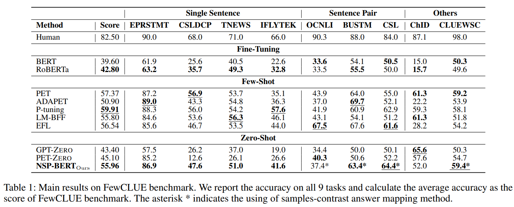
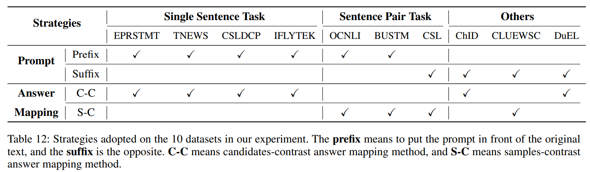

**[English](https://github.com/sunyilgdx/NSP-BERT)** | **[中文](https://github.com/sunyilgdx/NSP-BERT/blob/main/README_zh.md)**

## Overview

This is the code of our paper **[NSP-BERT: A Prompt-based Zero-Shot Learner Through an Original Pre-training Task —— Next Sentence Prediction](https://arxiv.org/abs/2109.03564)**. We use a **sentence-level** pre-training task **NSP (Next Sentence Prediction)** to realize prompt-learning and perform various downstream tasks, such as *single sentence classification*, *sentence pair classification*, *coreference resolution*, *cloze-style task*, *entity linking*, *entity typing*.

On the [FewCLUE benchmark](https://github.com/CLUEbenchmark/FewCLUE), our NSP-BERT outperforms other zero-shot methods (GPT-1-zero and PET-zero) on most of these tasks and comes close to the few-shot methods. We hope NSP-BERT can be an unsupervised tool that can assist other language tasks or models.

## News

**2022/8/17 New version!** For both zero-shot and few-shot NSP-BERT, English and Chinese. Baselines such as fine-tuning, NSP and PET are also implemented.
https://github.com/sunyilgdx/Prompts4Keras

**2022/6/16 There will be a major update soon！！！**

2021/11/12 **GLUE** and more English datasets have been added. We can download these datasets on [LM-BFF](https://github.com/princeton-nlp/LM-BFF). Thanks to [Gao Tianyu](https://github.com/gaotianyu1350).

2021/10/11 We uploaded the code on several English classification task datasets, **AG’s News, DBPedia, Amazon and IMDB**. The Acc. of NSP-BERT on those datasets are about 81.8, 70.9, 71.9 and 70.7 (We tested about 1K samples).
Thanks to [Shengding Hu](https://github.com/ShengdingHu) and his [KnowledgeablePromptTuning](https://github.com/ShengdingHu/KnowledgeablePromptTuning).

## Guide
| Section | Description |
|-|-|
| [Environment](#Environment) | The required deployment environment |
| [Downloads](#Downloads) | Download links for the models' checkpoints used by NSP-BERT |
| [Demos](#Demos) | Chinese and English demos |
| [Evaluation](#Evaluation) | Evaluate NSP-BERT for different downstream tasks |
| [Baselines](#Baselines) | Baseline results for several Chinese NLP datasets (partial) |
| [Model Comparison](#Model-Comparison) | Compare the models published in this repository |
| [Strategy Details](#Strategy-Details) | Some of the strategies used in the paper |
| [Discussion](#Discussion) | Discussion and Discrimination for future work |
| [Acknowledgements](#Acknowledgements)| Acknowledgements|
 
## Environment
The environments are as follows:
```
Python 3.6
bert4keras 0.10.6
tensorflow-gpu 1.15.0
```

## Downloads
### Models
We should dowmload the checkpoints of different models. The *vocab.txt* and the *config.json* are already in our [repository](https://github.com/sunyilgdx/NSP-BERT/tree/main/models).

| Organization                                      | Model Name       | Model Parameters      | Download Linking                                                                                | Tips |
|---------------------------------------------------|------------------|-----------------------|-------------------------------------------------------------------------------------------------|------|
| [Google](https://github.com/google-research/bert) | BERT-uncased     | L=12 H=769 A=12 102M  | [Tensorflow](https://storage.googleapis.com/bert_models/2020_02_20/uncased_L-12_H-768_A-12.zip) |      |
|                                                   | BERT-Chinese     | L=12 H=769 A=12 102M  | [Tensorflow](https://storage.googleapis.com/bert_models/2018_11_03/chinese_L-12_H-768_A-12.zip) |      |
| [HFL](https://github.com/ymcui/Chinese-BERT-wwm)  | BERT-wwm         | L=12 H=769 A=12 102M  | [Tensorflow](https://pan.iflytek.com/link/A2483AD206EF85FD91569B498A3C3879)|  |
|                                                   | BERT-wwm-ext     | L=12 H=769 A=12 102M  | [Tensorflow](https://pan.iflytek.com/link/A2483AD206EF85FD91569B498A3C3879)|  |
| [UER](https://github.com/dbiir/UER-py)            | BERT-mixed-tiny  | L=3  H=384 A=6  14M   | [Pytorch](https://share.weiyun.com/yXx0lfUg)  | \* |
|                                                   | BERT-mixed-Small | L=6  H=512 A=8  31M   | [Pytorch](https://share.weiyun.com/fhcUanfy)  | \* |
|                                                   | BERT-mixed-Base  | L=12 H=769 A=12 102M  | [Pytorch](https://share.weiyun.com/5QOzPqq)   | \* |
|                                                   | BERT-mixed-Large | L=24 H=1024 A=16 327M | [Pytorch](https://share.weiyun.com/5G90sMJ)   | \* |

\* We need to use [UER's convert tool](https://github.com/dbiir/UER-py/blob/master/scripts/convert_bert_from_uer_to_original_tf.py) to convert UER pytorch to Original Tensorflow.

### Datasets
We use FewCLUE datasets and DuEL2.0 (CCKS2020) in our experiments.
| Datasets           | Download Links                                              |
|--------------------|-------------------------------------------------------------|
| FewCLUE            | https://github.com/CLUEbenchmark/FewCLUE/tree/main/datasets |
| DuEL2.0 (CCKS2020) | https://aistudio.baidu.com/aistudio/competition/detail/83   |
| EnEval             | https://github.com/ShengdingHu/KnowledgeablePromptTuning    |

Put the datasets into the [NSP-BERT/datasets/]().

## Demos
Try to use *./demos/nsp_bert_classification_demo.py* and *./demos/nsp_bert_classification_demo_en.py* to accomplish your own classification tasks.
Edit your own **Labels** and **Samples**, then create your own **Prompt Templates**, then you can classify them.

```
...
label_names = ['entertainment', 'sports', 'music', 'games', 'economics', 'education']
patterns = ["This is {} news".format(label) for label in label_names]
demo_data_en = ['FIFA unveils biennial World Cup plan, UEFA threatens boycott',
               'COVID vaccines hold up against severe Delta: US data',
               'Justin Drew Bieber was born on March 1, 1994 at St. ',
               'Horizon launches latest chip to take on global rivals',
               'Twitch video gamers rise up to stop ‘hate raids’']
...
```
**Output**
```
Sample 0:
Original Text: FIFA unveils biennial World Cup plan, UEFA threatens boycott
Predict label: sports
Logits: [0.50525445, 0.9874593, 0.40805838, 0.9633584, 0.39732504, 0.22665949]

Sample 1:
Original Text: COVID vaccines hold up against severe Delta: US data
Predict label: economics
Logits: [0.8868228, 0.9359472, 0.795272, 0.93895626, 0.99118936, 0.86002237]

Sample 2:
Original Text: Justin Drew Bieber was born on March 1, 1994 at St. 
Predict label: music
Logits: [0.98517805, 0.97300863, 0.98871416, 0.95968705, 0.9250582, 0.9211884]
...
```


## Evaluation
We can run individual python files in the project directly to evaluate our NSP-BERT.

```
NSP-BERT
    |- datasets
        |- clue_datasets
           |- ...
        |- DuEL 2.0
           |- dev.json
           |- kb.json
        |- enEval
           |- agnews
           |- amazon
           |- dbpedia
           |- imdb
           
    |- demos
        |- nsp_bert_classification_demo.py
        |- nsp_bert_classification_demo_en.py
    |- models
        |- uer_mixed_corpus_bert_base
           |- bert_config.json
           |- vocab.txt
           |- bert_model.ckpt...
           |- ...
    |- nsp_bert_classification.py             # Single Sentence Classification
    |- nsp_bert_sentence_pair.py              # Sentence Pair Classification
    |- nsp_bert_cloze_style.py                # Cloze-style Task
    |- nsp_bert_coreference_resolution.py     # Coreference Resolution
    |- nsp_bert_entity_linking.py             # Entity Linking and Entity Typing
    |- utils.py
```

| Python File                            | Task                                 | Datasets                           |
|----------------------------------------|--------------------------------------|------------------------------------|
| [nsp_bert_classification.py]()         | **Single Sentence Classification**   | *EPRSTMT, TNEWS, CSLDCP, IFLYTEK*  |
|                                        |                                      | *AG’s News, DBPedia, Amazon, IMDB* |
| [nsp_bert_sentence_pair.py]()          | **Sentence Pair Classification**     | *OCNLI, BUSTM, CSL*                |
| [nsp_bert_cloze_style.py]()            | **Cloze-style Task**                 | *ChID*                             |
| [nsp_bert_coreference_resolution.py]() | **Coreference Resolution**           | *CLUEWSC*                          |
| [nsp_bert_entity_linking.py]()         | **Entity Linking and Entity Typing** | *DuEL2.0*                          |

## Baselines

Reference FewCLUE, we choos 3 training scenarios, fine-tuning, few-shot and zero-shot.
The baselines use Chineses-RoBERTa-Base and Chinses-GPT-1 as the backbone model.

### Methods
| Scenarios       | Methods                               |
|-----------------|---------------------------------------|
| **Fine-tuning** | *BERT, RoBERTa*                       |
| **Few-Shot**    | *PET, ADAPET,  P-tuning, LM-BFF, EFL* |
| **Zero-Shot**   | *GPT-zero, PET-zero*                  |

### Downloads

| Organization                                                                                             | Model Name              | Model Parameters     | Download Linking                                                            |
|----------------------------------------------------------------------------------------------------------|-------------------------|----------------------|-----------------------------------------------------------------------------|
| [huawei-noah](https://github.com/huawei-noah/Pretrained-Language-Model/tree/master/NEZHA-Gen-TensorFlow) | Chinese GPT             | L=12 H=769 A=12 102M | [Tensorflow](https://pan.baidu.com/s/1Bgle8TpcxHyuUz_jAXOBWw)               |
| [HFL](https://github.com/ymcui/Chinese-BERT-wwm)                                                         | RoBERTa-wwm-ext | L=12 H=769 A=12 102M | [Tensorflow](https://pan.iflytek.com/link/98D11FAAF0F0DBCB094EE19CCDBC98BF) |


## Model Comparison

<br/><br/>

## Strategy Details

<br/><br/>


## Discussion

* Sincce NSP-BERT is a sentence-level prompt-learning model, it is significantly superior to GPT-zero and PET-zero in terms of **Single Sentence Classification** tasks (*TNEWS, CSLDCP and IFLYTEK*). At the same time, it can solve the **Entity Linking** task (*DuEL2.0*), and the model is not limited by the non-fixed-length entity description, which GPT-zero and PET-zero cannot do this.
* However, it doesn't work as well on **Token-Level** tasks, such as **Cloze-style** task and **Entity Typing**.
* In future work, it is essential to extend NSP-BERT to the few-shot scenario.

## Acknowledgements

* Our code is based on [Jianlin Su](https://github.com/bojone)'s [bert4keras](https://github.com/bojone/bert4keras).
* Thanks to teacher Su Jianlin's blog, [Science Space](https://kexue.fm/), his series of blogs, and his open source spirit, which inspired and inspired my paper writing process.

## Citation

```
@misc{sun2021nspbert,
    title={NSP-BERT: A Prompt-based Zero-Shot Learner Through an Original Pre-training Task--Next Sentence Prediction},
    author={Yi Sun and Yu Zheng and Chao Hao and Hangping Qiu},
    year={2021},
    eprint={2109.03564},
    archivePrefix={arXiv},
    primaryClass={cs.CL}
}
```
